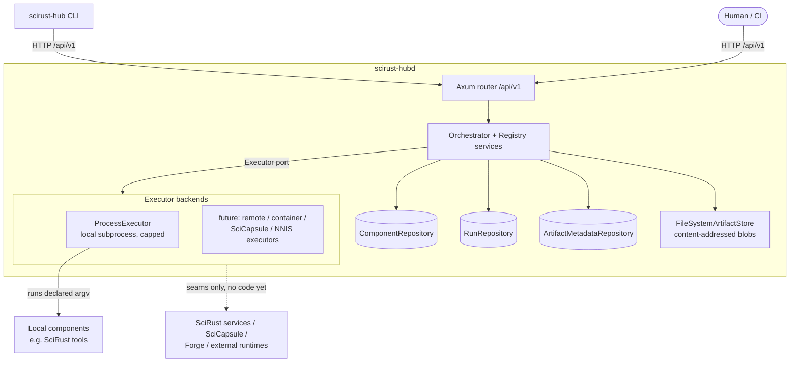

# SciRust Hub — Integration model

The Hub is a single-node control plane. Components register *descriptions*;
executions happen through executor backends that the Hub supervises but does
not absorb.

## Flow of the first vertical slice

1. `POST /api/v1/components` registers a manifest (validated, digested,
   idempotent for identical content). **No code executes at registration.**
2. `POST /api/v1/runs` submits a RunSpec referencing a component and one of
   its capabilities; the orchestrator validates it against the registry.
3. The validated run is queued, then executed by the configured executor in a
   per-run working directory with materialized input artifacts.
4. Captured outputs become content-addressed artifacts; stdout/stderr are
   stored as capped artifacts referenced from provenance.
5. A provenance-bearing `RunRecord` is persisted and served back through the
   API/CLI.

## What integration means here

"Integrating X" = registering a truthful manifest for X (its real identity,
declared capabilities, verified execution binding) and, when a contract is
verified, executing it through a backend that speaks to it. It never means
absorbing X's code into the Hub. Unverified integrations stay listed under
"Not yet established" in `BOUNDARIES.md` instead of being simulated.
