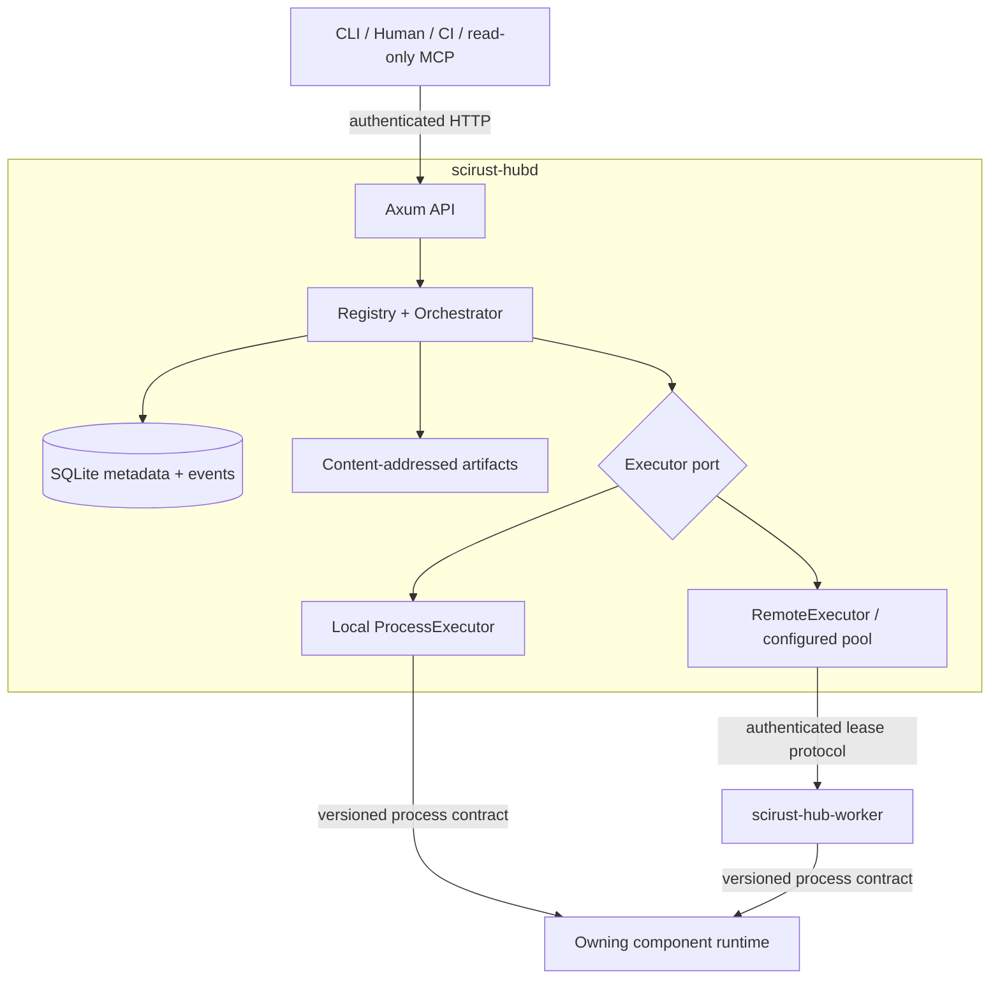

# SciRust Hub — Integration model

The Hub is a single-node control plane. Components register *descriptions*;
executions happen through executor backends that the Hub supervises but does
not absorb.

```mermaid
flowchart TD
    CLIENT[CLI / Human / CI / read-only MCP] -->|authenticated HTTP| API
    subgraph Daemon[scirust-hubd]
        API[Axum API] --> SVC[Registry + Orchestrator]
        SVC --> STORE[(SQLite metadata + events)]
        SVC --> BLOB[Content-addressed artifacts]
        SVC --> EX{Executor port}
        EX --> LOCAL[Local ProcessExecutor]
        EX --> REMOTE[RemoteExecutor / configured pool]
    end
    REMOTE -->|authenticated lease protocol| WORKER[scirust-hub-worker]
    LOCAL -->|versioned process contract| COMPONENT[Owning component runtime]
    WORKER -->|versioned process contract| COMPONENT
```

The local and remote executors provide bounded process supervision, not an OS
sandbox. Registration remains metadata-only. Remote execution transports the
declared workdir-relative inputs and outputs and does not assume a shared
filesystem. A configured remote-worker pool performs descriptor discovery and
deterministic local-load placement; it is not yet dynamic resource-aware global
scheduling.

## Current execution flow

1. `POST /api/v1/components` registers a manifest (validated, digested,
   idempotent for identical content). **No code executes at registration.**
2. `POST /api/v1/runs` submits a RunSpec referencing a component and one of
   its capabilities; the orchestrator validates it against the registry.
3. The validated run is queued, then executed by the configured executor in a
   per-run working directory with materialized input artifacts.
4. Captured outputs become content-addressed artifacts; stdout/stderr are
   stored as capped artifacts referenced from provenance.
5. A provenance-bearing `RunRecord` is persisted and served back through the
   API/CLI.

## Qualified adapter catalogue

The following published edges are tied to exact Hub merge revisions. A row
qualifies only its named wire/process contract; it does not transfer the owning
product's scientific or runtime semantics into Hub.

| Capability family | Owning runtime / source | Qualified Hub merge | Scope |
| --- | --- | --- | --- |
| `capsule.execute@1/2`, `capsule.verify.scicapsule@1` | SciCapsule / SciRust-Verify | [`4591869`](https://github.com/Memorithm/scirust-hub/commit/4591869ab10835708d18c836d0c97a73bc868d9c) | Capsule inputs, trust request and result/dossier hand-off |
| `llm.train@1`, `llm.eval@1`, `llm.export@1` | SOUP at qualified source `05b6465` | [`3317300`](https://github.com/Memorithm/scirust-hub/commit/3317300d33cfb412f90dede64257833d3e8cdfd2) | Bounded process adapters and deterministic output bundles |
| `llm.train.elastic@1` | ElasticXxx contract merge `6e0952e` | [`66fcd61`](https://github.com/Memorithm/scirust-hub/commit/66fcd61a8b7d8ad39425b1725b94919f5abc210f) | Immutable pre-execution resource plan; no in-Hub Elastic loop |
| `llm.train.scirust_symbolic@1` | SciRust merge `f6bdadb` | [`ee9df73`](https://github.com/Memorithm/scirust-hub/commit/ee9df7306ef2573e350c55cd14bf85ea3cbbd841) | Symbolic-equivalence reward seam only |
| `llm.optimize.forge_soup@1` | Forge domain/runner merges `1385c71` / `9e1f3fc` | [`074cf2c`](https://github.com/Memorithm/scirust-hub/commit/074cf2c6e00a0b142fe46d1558c8b32df9228859) | Local Forge search over SOUP evidence; no distributed hostile-code claim |
| `inference.nnis.parity_validate@1`, `inference.nnis.parity_verify@1` | NNIS merge `0ae4b0d`, Verify merge `593692a` | [`0e484d9`](https://github.com/Memorithm/scirust-hub/commit/0e484d9f9903fe0f0fcb7111e0191dfb14d958b4) | Validation and immutable Verify hand-off of existing evidence |

The exact source heads, PR heads, merge commits and required-CI identities are
maintained in the non-default `agent/ecosystem-roadmap` roadmap. Documentation
must not promote a conceptual relationship to a published edge without those
versioned-contract and exact-head qualification records.

## What integration means here

"Integrating X" = registering a truthful manifest for X (its real identity,
declared capabilities, verified execution binding) and, when a contract is
verified, executing it through a backend that speaks to it. It never means
absorbing X's code into the Hub. Unverified integrations remain explicitly
planned or unavailable instead of being represented by a simulated adapter.
